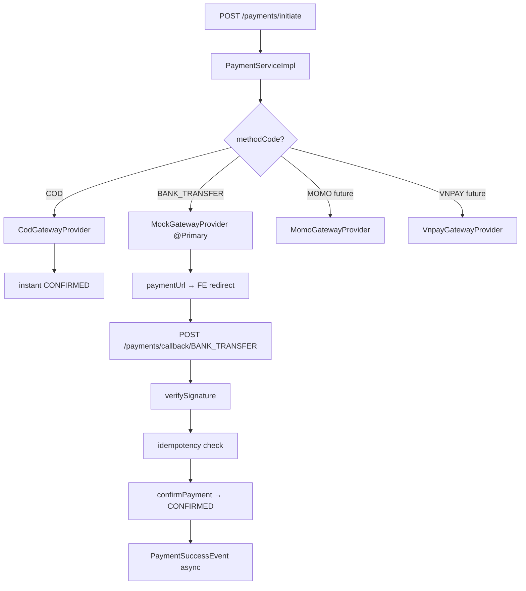

# API Contract: Phase 8 – Payment (Thanh Toán)

> [!IMPORTANT]
> **FE MUST store `bookingCode` (UUID) from Phase 7 response and use `bookingId` (Long) in payment initiation.**

## Base URL: `/api/v1`

---

## 💰 Payment Endpoints

### 1. Danh sách phương thức thanh toán
- **Endpoint**: `GET /payment-methods`
- **Auth**: Public (no token needed)
- **Response (200)**:
```json
{
  "data": [
    { "id": 1, "code": "COD", "name": "Thanh toán tại quầy", "isActive": true, "feePercentage": 0.00 },
    { "id": 2, "code": "BANK_TRANSFER", "name": "Chuyển khoản ngân hàng", "isActive": true, "feePercentage": 0.00 }
  ]
}
```
> Chỉ trả về `isActive=true`. MOMO, VNPAY sẽ xuất hiện sau khi bật.

---

### 2. Khởi tạo thanh toán
- **Endpoint**: `POST /payments/initiate`
- **Auth**: USER (`Bearer <token>`)
- **Request Body**:
```json
{
  "bookingId": 42,
  "methodCode": "BANK_TRANSFER"
}
```
> ⚠️ Không gửi `amount` — server tự lấy từ `booking.final_price`

- **Success (201)**:
```json
{
  "data": {
    "paymentId": 7,
    "bookingCode": "550e8400-e29b-41d4-a716-446655440000",
    "amount": 700000.00,
    "paymentUrl": "https://mock-pay.local/7?returnUrl=https://busozy.vn/payment/result&ref=7",
    "qrCodeData": null,
    "directPayUrl": null
  }
}
```

#### Phân nhánh theo methodCode:

| `methodCode` | `paymentUrl` | Hành động FE |
|---|---|---|
| `COD` | `null` | Thanh toán ngay, hiển thị vé xác nhận |
| `BANK_TRANSFER` | URL mock sandbox | Redirect/mở tab đến `paymentUrl` |
| `MOMO` *(Phase sau)* | Deep link | Mở app MoMo |
| `VNPAY` *(Phase sau)* | URL VNPAY | Redirect sang cổng VNPAY |

#### COD Flow:
```
FE: POST /payments/initiate { bookingId, methodCode: "COD" }
→ Server: booking.status=CONFIRMED, booking.paymentStatus=PAID instantly
→ paymentUrl = null
→ FE: navigate sang /booking/{code}/success
```

#### BANK_TRANSFER Flow (Mock):
```
FE: POST /payments/initiate { bookingId, methodCode: "BANK_TRANSFER" }
→ paymentUrl = "https://mock-pay.local/7?returnUrl=..."
→ FE: window.location.href = paymentUrl
→ User: thực hiện nhập thông tin
→ Mock gateway: redirect về returnUrl?transactionId=xxx&resultCode=SUCCESS
→ FE: poll GET /payments/{id} để verify trạng thái
```

---

### 3. Kiểm tra trạng thái thanh toán
- **Endpoint**: `GET /payments/{id}`
- **Auth**: USER (owner only)
- **Response (200)**:
```json
{
  "data": {
    "paymentId": 7,
    "bookingCode": "550e8400-...",
    "methodCode": "BANK_TRANSFER",
    "amount": 700000.00,
    "status": "PAID",
    "gatewayTransactionId": "TXN-12345"
  }
}
```
> **FE nên poll endpoint này mỗi 3 giây** sau khi redirect về từ gateway, tối đa 5 lần, cho đến khi `status != PENDING`.

---

### 4. Hủy thanh toán
- **Endpoint**: `POST /payments/{id}/cancel`
- **Auth**: USER (owner only)
- **Constraints**: Chỉ hủy được khi `status = PENDING`
- **Error**: `PAY_004` nếu đã xử lý rồi

---

### 5. Webhook callback từ cổng (Backend-facing)
- **Endpoint**: `POST /payments/callback/{provider}`
- **Auth**: Public (gateway calls this directly)
- **Provider examples**: `BANK_TRANSFER`, `MOMO`, `VNPAY`
- **Query Params** (từ gateway): `transactionId`, `resultCode`, `bookingId`, ...
- **Response**: Luôn `200 OK` (đã verify → gateway không retry)
> ⚠️ FE không gọi endpoint này trực tiếp. Chỉ gateway và testing tool (curl/Postman) mới gọi.

**Test mock callback (simulate success)**:
```bash
curl -X POST "http://localhost:8080/api/v1/payments/callback/BANK_TRANSFER?transactionId=TXN-999&bookingId=42&resultCode=SUCCESS"
```

---

## PaymentStatus Enum

| Value | Mô tả |
|---|---|
| `PENDING` | Chờ thanh toán (booking vẫn đang giữ ghế) |
| `PAID` | Đã thanh toán thành công — booking sẽ là CONFIRMED |
| `FAILED` | Thanh toán thất bại (gateway từ chối) |
| `CANCELLED` | User hủy trước khi thanh toán |
| `REFUNDED` | Hoàn tiền — Phase 11 |

---

## Error Codes (Phase 8)

| Code | HTTP | Mô tả |
|---|---|---|
| `PAY_001` | 400 | Booking không tồn tại, không thuộc user, hoặc không ở trạng thái PENDING/chưa hết hạn |
| `PAY_002` | 400 | Phương thức thanh toán không hỗ trợ hoặc không active |
| `PAY_003` | 400 | Chữ ký webhook không hợp lệ (gateway signature mismatch) |
| `PAY_004` | 200 | Giao dịch đã được xử lý — idempotency hit, trả 200 để gateway dừng retry |
| `PAY_005` | 400 | Số tiền không khớp (server enforces amount từ booking.final_price) |
| `PAY_006` | 503 | Cổng thanh toán timeout/lỗi |

---

## Migration Changes (⚠️ Important for DevOps)

> [!WARNING]
> **V8 migration file đã được đổi tên!** Nếu Flyway đã chạy trên DB cũ với `V8__create_booking_tables.sql`, cần dùng `flyway repair`.

| Version | File | Nội dung |
|---|---|---|
| V8 | `V8__add_user_roles_and_vendor_support.sql` | User role column + constraints |
| V9 | `V9__create_booking_tables.sql` | bookings, booking_seats, passengers |
| V10 | `V10__create_payment_tables.sql` | payment_methods (seeded) + payments |

---

## Architecture: Gateway Strategy Pattern

```
Thêm cổng mới (VD: VNPAY) không cần động vào PaymentService:

1. Tạo class VnpayGatewayProvider implements PaymentGatewayProvider
2. Implement: supports("VNPAY"), initiate(), verifySignature(), processCallback()
3. Thêm @Component + @Primary (bỏ @Primary khỏi MockGatewayProvider)
4. Cấu hình secretKey trong application.yml
```


